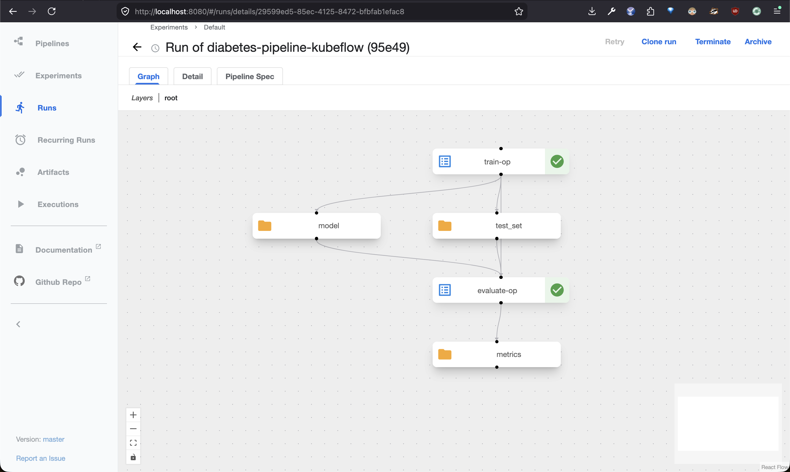

# 🩺 Diabetes Prediction Model – MLOps Project (FastAPI + Docker + K8s)

An end-to-end MLOps project I built to learn the workflow of training, serving, containerizing, and deploying a machine learning model. It predicts whether a person is diabetic based on health metrics, and walks through:

- ✅ Model Training
- ✅ Building the Model locally
- ✅ API Deployment with FastAPI
- ✅ Dockerization
- ✅ Kubernetes Deployment
- ✅ Kubeflow Pipeline (training orchestration)
- ✅ Closed train → serve loop (pipeline publishes model to seaweedfs; API pulls it on rollout)

---

## 📊 Problem Statement

Predict if a person is diabetic based on:
- Pregnancies
- Glucose
- Blood Pressure
- BMI
- Age

We use a Random Forest Classifier trained on the **Pima Indians Diabetes Dataset**.

---

## 🚀 Quick Start

### 1. Clone the Repo

```bash
git clone https://github.com/yashyaadav/first-mlops-project.git
cd first-mlops-project
```

### 2. Create Virtual Environment

```
python3 -m venv .mlops
source .mlops/bin/activate
```

### 3. Install Dependencies

```
pip install -r requirements.txt
```

## Train the Model

```
python train.py
```

## Run the API Locally

```
uvicorn main:app --reload
```

### Sample Input for /predict

```
{
  "Pregnancies": 2,
  "Glucose": 130,
  "BloodPressure": 70,
  "BMI": 28.5,
  "Age": 45
}
```

## Dockerize the API

### Build the Docker Image

```
docker build -t diabetes-prediction-model .
```

### Run the Container

```
docker run -p 8000:8000 diabetes-prediction-model
```

## Deploy to Kubernetes

For a real cluster (image pushed to a registry, LoadBalancer service):

```
kubectl apply -f k8s-deploy.yml
```

### Try it locally on a kind cluster

`k8s-deploy-kind.yml` uses the locally-built image and a NodePort service so you can run it without a registry or cloud LB. Spin up a cluster, load the image into it, and apply:

```
kind create cluster
kind load docker-image diabetes-prediction-model:latest
kubectl apply -f k8s-deploy-kind.yml
```

Verify the image landed on the node (kind nodes run containerd, so use `crictl`):

```
docker exec -it kind-control-plane crictl images | grep diabetes
```

(If you named the cluster, the container is `<cluster-name>-control-plane`.)

Forward the service to your host and hit it at http://localhost:8000:

```
kubectl port-forward svc/diabetes-api-service 8000:80
```

Tear down when you're done:

```
kind delete cluster
```

---

## 🔬 Kubeflow Pipeline (optional)

Run training as a tracked Kubeflow Pipeline instead of a one-off `python train.py`. See [kubeflow/](kubeflow/) for the pipeline definition and a longer walkthrough.

Assuming Kubeflow Pipelines is installed in your kind cluster (in the `kubeflow` namespace), port-forward the UI:

```
kubectl port-forward -n kubeflow svc/ml-pipeline-ui 8080:80
```

Then open http://localhost:8080.

Set up a **separate** virtual environment for the KFP SDK (it pulls in ~40 transitive deps you don't want mixing with the FastAPI venv):

```
python3.12 -m venv .kfp
source .kfp/bin/activate
pip install --upgrade pip
pip install -r kubeflow/requirements.txt
```

Compile the pipeline:

```
python kubeflow/pipeline.py     # produces diabetes_pipeline.yaml
deactivate                      # when you're done; reactivate .mlops for serving work
```

In the KFP UI, click **Upload Pipeline**, select `diabetes_pipeline.yaml`, then create a run. Metrics (accuracy, precision, recall, F1) and the trained model artifact appear in the run view.



---

## 🔁 Closing the Train → Serve Loop

Out of the box, the FastAPI image bakes in `diabetes_model.pkl` — useful for `docker run` but not realistic: a new model trained by the pipeline can't reach the serving pods. To close the loop, the pipeline now also uploads the trained model to seaweedfs (S3-compatible, already running in the kubeflow namespace), and the API pulls it on startup when `MODEL_S3_URI` is set.

```
[KFP train_op] trains model → boto3.upload → s3://mlpipeline/models/diabetes/latest.pkl
                                                       ↓
[diabetes-api pods] on startup → boto3.download → joblib.load → serve
```

### One-time setup

**1. Mirror the seaweedfs creds into the `default` namespace.** The serving deployment lives in `default` but the creds live in `kubeflow`:

```
kubectl create secret generic s3-creds \
  --from-literal=access-key=minio \
  --from-literal=secret-key=minio123
```

(These are the demo creds Kubeflow Pipelines ships with — don't reuse outside a local cluster.)

**2. Allow the API pods to reach seaweedfs across namespaces.** Kubeflow's default `seaweedfs` NetworkPolicy blocks ingress from outside the `kubeflow` namespace, which would cause the API to hang at startup trying to download the model. Apply the extra policy:

```
kubectl apply -f k8s-allow-api-to-seaweedfs.yml
```

### Workflow per training run

1. **Run the pipeline in the KFP UI** (or `python kubeflow/pipeline.py` then upload + run). At the end of `train-op` you should see `✅ Uploaded model to s3://mlpipeline/models/diabetes/latest.pkl` in the pod logs.
2. **Roll out the API** so fresh pods pull the new model on startup:
   ```
   kubectl rollout restart deployment diabetes-api
   kubectl rollout status deployment diabetes-api
   ```
3. **Test the new model**:
   ```
   kubectl port-forward svc/diabetes-api-service 8000:80
   curl -X POST http://localhost:8000/predict \
     -H 'Content-Type: application/json' \
     -d '{"Pregnancies":2,"Glucose":130,"BloodPressure":70,"BMI":28.5,"Age":45}'
   ```

### Verifying the model is actually being pulled from S3

```
kubectl logs deployment/diabetes-api | head -20
```

You should see no `InconsistentVersionWarning` (the pipeline trains with the same sklearn version the container runs) and the API starts normally. To inspect the object directly:

```
kubectl exec -n kubeflow deploy/seaweedfs -- \
  weed shell -filer=seaweedfs:8888 <<<'fs.ls /buckets/mlpipeline/models/diabetes'
```

---

## 🙌 Credits

This project is based on the **"Build Your First MLOps Project"** tutorial by Abhishek Veeramalla. All credit for the original walkthrough goes to him — check out his YouTube channel `Abhishek.Veeramalla` for great DevOps + MLOps content.

I worked through it as my first hands-on MLOps project to learn the model → API → container → Kubernetes pipeline end-to-end.

