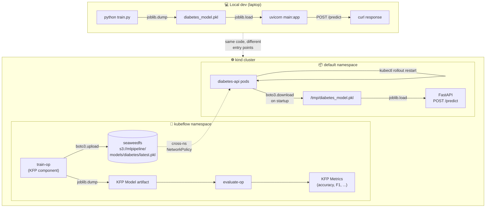
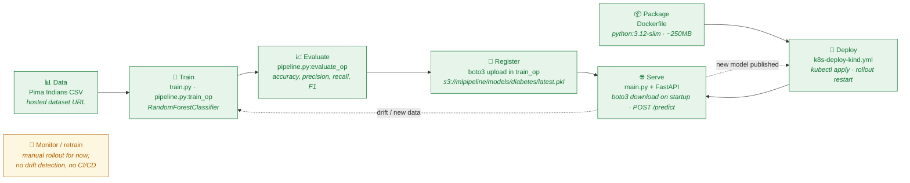

# 🩺 Diabetes Prediction Model – MLOps Project

An end-to-end MLOps walkthrough: train a model locally, serve it with FastAPI, containerize it, deploy to Kubernetes, then promote training to a Kubeflow Pipeline and close the loop so the serving pods pull each new model from object storage.

The serving model predicts whether a patient is diabetic (Pima Indians dataset) from five health metrics. The ML side is intentionally simple — the point of the project is the **MLOps glue around it**.

- ✅ Model training (local + Kubeflow Pipelines)
- ✅ FastAPI serving
- ✅ Dockerized image
- ✅ Kubernetes deployment (kind for local, manifest for real clusters)
- ✅ Kubeflow Pipeline (tracked runs, artifacts, metrics)
- ✅ Closed train → serve loop (pipeline publishes model to seaweedfs; API pulls it on rollout)

---

## 🏗️ Architecture

Two paths through the same code: a **local dev** path for fast iteration, and a **closed-loop in-cluster** path that's the real MLOps story.



---

## 🔄 MLOps Lifecycle

How the classic MLOps lifecycle stages map onto concrete pieces of this repo. The grey edges back from **Serve** are the iteration loops: a new model triggers a rollout, a drift signal (out of scope here) triggers retraining.



**Status per stage:**

| # | Stage | Implementation | Status |
|---|---|---|---|
| 1 | Data | Hosted Pima Indians CSV (`plotly/datasets`) | ✅ |
| 2 | Train | `train.py` locally, or `kubeflow/pipeline.py:train_op` in KFP | ✅ |
| 3 | Evaluate | `kubeflow/pipeline.py:evaluate_op` logs metrics as KFP artifacts | ✅ |
| 4 | Register | `boto3.upload_file` to seaweedfs inside `train_op` | ✅ |
| 5 | Package | `Dockerfile` builds `diabetes-prediction-model:latest` | ✅ |
| 6 | Deploy | `k8s-deploy-kind.yml` (NodePort) + `k8s-deploy.yml` (LB for real clusters) | ✅ |
| 7 | Serve | `main.py` + FastAPI; pulls model from S3 on startup if `MODEL_S3_URI` set | ✅ |
| 8 | Monitor / retrain trigger | Manual `kubectl rollout restart` after pipeline runs | ⚠️ stub |
| 9 | CI/CD | Not implemented | ❌ |
| 10 | Drift detection / shadow eval | Not implemented | ❌ |

---

## 📊 Problem statement

Predict whether a person is diabetic based on:

- Pregnancies, Glucose, Blood Pressure, BMI, Age

Trained on the **Pima Indians Diabetes Dataset** (hosted CSV) with a `RandomForestClassifier`.

---

## 📋 Prerequisites

| Tool | Why |
|---|---|
| Python 3.12 | `scikit-learn==1.9.0` requires Python ≥3.11 |
| Docker Desktop | Build/run the serving image |
| `kind` ≥ 0.32 | Local Kubernetes cluster |
| `kubectl` | Talk to the cluster |
| Kubeflow Pipelines (KFP) | Only needed for the pipeline + closed-loop sections — install in your kind cluster following [kfp docs](https://www.kubeflow.org/docs/components/pipelines/) |

---

## 🚀 Quick Start (local)

```bash
git clone https://github.com/yashyaadav/first-mlops-project.git
cd first-mlops-project

python3.12 -m venv .mlops
source .mlops/bin/activate
pip install --upgrade pip
pip install -r requirements.txt

python train.py                   # produces diabetes_model.pkl
uvicorn main:app --reload         # http://localhost:8000/docs
```

**Sample request:**

```bash
curl -X POST http://localhost:8000/predict \
  -H 'Content-Type: application/json' \
  -d '{"Pregnancies":2,"Glucose":130,"BloodPressure":70,"BMI":28.5,"Age":45}'
# → {"diabetic": true}
```

---

## 🐳 Dockerize

```bash
docker build -t diabetes-prediction-model .
docker run -p 8000:8000 diabetes-prediction-model
```

The image is `python:3.12-slim` based (~250MB) and falls back to the locally-baked `diabetes_model.pkl` when no `MODEL_S3_URI` env var is set.

---

## ☸️ Deploy to Kubernetes

### Real cluster

Push the image to a registry, then:

```bash
kubectl apply -f k8s-deploy.yml
```

Uses a `LoadBalancer` service — replace the image reference with your registry path first.

### Local kind cluster

`k8s-deploy-kind.yml` uses the locally-built image and a `NodePort` service, so no registry or cloud LB is needed.

```bash
kind create cluster --name kubeflow
kind load docker-image diabetes-prediction-model:latest --name kubeflow
kubectl apply -f k8s-deploy-kind.yml
```

Verify the image landed on the node (kind nodes run containerd, so use `crictl`):

```bash
docker exec -it kubeflow-control-plane crictl images | grep diabetes
```

Port-forward and hit it at http://localhost:8000:

```bash
kubectl port-forward svc/diabetes-api-service 8000:80
```

Tear down when done: `kind delete cluster --name kubeflow`.

---

## 🔬 Kubeflow Pipeline

Run training as a tracked Kubeflow Pipeline instead of `python train.py` on your laptop. See [kubeflow/](kubeflow/) for the pipeline source.

**1. Port-forward the KFP UI:**

```bash
kubectl port-forward -n kubeflow svc/ml-pipeline-ui 8080:80
```

http://localhost:8080.

**2. Set up a dedicated venv** for the KFP SDK (~40 transitive deps you don't want mixing with `.mlops`):

```bash
python3.12 -m venv .kfp
source .kfp/bin/activate
pip install --upgrade pip
pip install -r kubeflow/requirements.txt
```

**3. Compile the pipeline:**

```bash
python kubeflow/pipeline.py       # produces diabetes_pipeline.yaml
deactivate                         # reactivate .mlops when you go back to serving
```

**4. In the KFP UI:**

1. **Pipelines → Upload pipeline** → pick `diabetes_pipeline.yaml`, name it `diabetes-pipeline-kubeflow`.
2. After the first upload, future iterations use **+ Upload version** (not a new pipeline) — give each version a name like `v3-closed-loop`.
3. **+ Create run**, leave the pipeline params at their defaults (they match the in-cluster seaweedfs), submit.

A successful run produces metrics on `evaluate-op` and uploads the trained model to seaweedfs:


---

## 🔁 Closing the Train → Serve Loop

The pipeline uploads each trained model to `s3://mlpipeline/models/diabetes/latest.pkl` (seaweedfs, already running in the kubeflow namespace), and the API container downloads it on startup when `MODEL_S3_URI` is set. After a successful pipeline run, `kubectl rollout restart deployment diabetes-api` pulls the new model into fresh pods.

### One-time setup

**1. Mirror the seaweedfs credentials into the `default` namespace.** The serving deployment lives in `default` but the secret lives in `kubeflow`:

```bash
kubectl create secret generic s3-creds \
  --from-literal=access-key=minio \
  --from-literal=secret-key=minio123
```

(These are the demo creds Kubeflow Pipelines ships with — don't reuse outside a local cluster.)

**2. Allow the API pods to reach seaweedfs across namespaces.** Kubeflow's default `seaweedfs` NetworkPolicy blocks ingress from outside `kubeflow`, which would otherwise hang the API at startup:

```bash
kubectl apply -f k8s-allow-api-to-seaweedfs.yml
```

**3. (Re)deploy the API with the env-var wiring from `k8s-deploy-kind.yml`:**

```bash
kubectl apply -f k8s-deploy-kind.yml
```

### Per training-run workflow

```bash
# 1. Run the pipeline (in the KFP UI) → wait until both ops are green
# 2. Roll out the API so new pods pull the fresh model
kubectl rollout restart deployment diabetes-api
kubectl rollout status deployment diabetes-api

# 3. Test
kubectl port-forward svc/diabetes-api-service 8000:80
curl -X POST http://localhost:8000/predict \
  -H 'Content-Type: application/json' \
  -d '{"Pregnancies":2,"Glucose":130,"BloodPressure":70,"BMI":28.5,"Age":45}'
```

### Troubleshooting

| Symptom | Likely cause | Fix |
|---|---|---|
| `curl: (52) Empty reply from server`; empty pod logs | API hung downloading from seaweedfs — NetworkPolicy not applied | `kubectl apply -f k8s-allow-api-to-seaweedfs.yml` then `kubectl rollout restart deployment diabetes-api` |
| Pod `CreateContainerConfigError` on `S3_ACCESS_KEY` | `s3-creds` secret missing in `default` ns | Run the `kubectl create secret` from step 1 |
| Pipeline `train-op` fails with `No matching distribution for scikit-learn==1.9.0` | Component base image is pre-3.11 Python | Pipeline already uses `python:3.12-slim`; recompile `pipeline.py` if you edited it |
| `InconsistentVersionWarning` on API startup | sklearn version drift between training and serving | Both are pinned to 1.9.0 — rebuild + reload the serving image |

---

## 📁 Project layout

```
.
├── train.py                       Local training: pulls CSV, trains RF, dumps pkl
├── main.py                        FastAPI app; loads model from S3 if MODEL_S3_URI set, else local pkl
├── requirements.txt               Serving deps (fastapi, sklearn, boto3, ...)
├── Dockerfile                     python:3.12-slim + uvicorn entrypoint
├── k8s-deploy.yml                 Deployment + LoadBalancer Service (real cluster)
├── k8s-deploy-kind.yml            Deployment + NodePort Service + S3 env vars (local kind)
├── k8s-allow-api-to-seaweedfs.yml NetworkPolicy: lets API in `default` reach seaweedfs in `kubeflow`
├── kubeflow/
│   ├── pipeline.py                KFP v2 pipeline: train_op (+ S3 upload) → evaluate_op
│   ├── requirements.txt           kfp SDK
│   └── README.md                  Pipeline-specific walkthrough
└── docs/
    └── kfp-run-success.png        Screenshot of a successful KFP run
```

---

## 🙌 Credits

This project started from the **"Build Your First MLOps Project"** tutorial by Abhishek Veeramalla — check out his YouTube channel `Abhishek.Veeramalla` for great DevOps + MLOps content.

I extended it with the Kubeflow Pipelines integration and the closed train → serve loop as a hands-on learning exercise.
